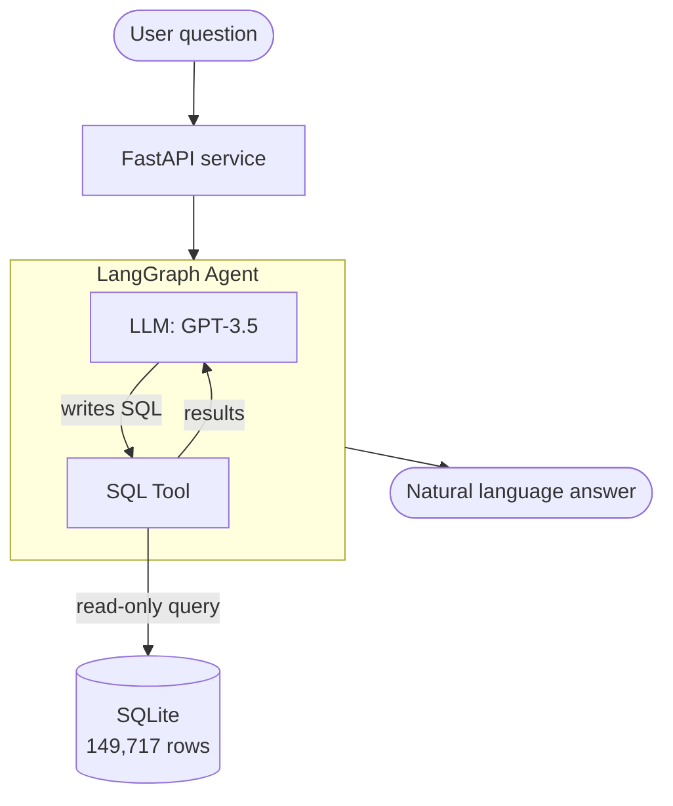

# SQL Chat Agent

> Ask questions about a credit-risk database in plain English. An AI agent writes the SQL, runs it safely, and replies in natural language.

Built with **LangGraph**, **OpenAI**, **SQLite**, and **FastAPI**. The agent turns natural-language questions (e.g. *"Which age group has the highest default rate?"*) into SQL queries, executes them against a 149K-row credit dataset, and returns a clear answer — no SQL knowledge required from the user.

---

## What it does

```
User:  "How many borrowers defaulted on their loans?"
Agent: → writes SQL: SELECT COUNT(*) FROM borrowers WHERE is_default = 1
       → executes it safely (read-only)
       → "There are 9,878 borrowers who defaulted within 2 years."
```

The agent decides on its own when to query the database, can run multiple queries in sequence, and self-corrects if a query fails.

---

## Architecture



The agent runs a loop: the LLM decides whether a SQL query is needed, the tool executes it, the result feeds back to the LLM, and the loop continues until a final answer is ready.

---

## Tech stack

| Layer | Technology |
|-------|-----------|
| LLM | OpenAI GPT-3.5-turbo |
| Agent framework | LangChain + LangGraph |
| Database | SQLite |
| API | FastAPI + Pydantic |
| Data | Kaggle "Give Me Some Credit" (cleaned) |

---

## Key features

- **Natural language to SQL** — users ask questions in plain English
- **Agentic loop** — built with LangGraph (state, nodes, conditional edges)
- **Read-only safety** — blocks non-SELECT queries, dangerous keywords (DROP, DELETE), and limits result size to prevent token overflow
- **Schema-aware prompting** — the LLM receives an annotated schema, reducing hallucinated column names
- **Few-shot guidance** — handles ambiguous requests like "age groups" with explicit bucketing rules and statistical-significance filters
- **Self-correction** — SQL errors are returned to the LLM so it can retry

---

## Project structure

```
sql-chat-agent/
├── data/
│   ├── cleaned_data.csv      # source data
│   └── credit.db             # generated SQLite database
├── notebooks/                # development & exploration
│   ├── 01_basic_chat.ipynb
│   ├── 02_langchain_intro.ipynb
│   ├── 03_langgraph_intro.ipynb
│   ├── 04_sql_setup.ipynb
│   └── 05_sql_agent.ipynb
├── src/                      # production code
│   ├── config.py             # settings & paths
│   ├── database.py           # DB connection + safe query + schema
│   ├── agent.py              # SQL tool + LangGraph agent
│   └── api.py                # FastAPI service
├── requirements.txt
└── README.md
```

---

## Setup

**1. Clone and install**

```bash
git clone https://github.com/Shakhriyor-git/sql-chat-agent.git
cd sql-chat-agent
python -m venv venv
venv\Scripts\activate        # Windows
# source venv/bin/activate   # Mac/Linux
pip install -r requirements.txt
```

**2. Add your OpenAI API key**

Create a `.env` file in the project root:

```
OPENAI_API_KEY=sk-...
```

**3. Build the database**

Run `notebooks/04_sql_setup.ipynb` once to generate `data/credit.db` from the CSV.

**4. Start the API**

```bash
uvicorn src.api:app --reload
```

Open `http://127.0.0.1:8000/docs` for the interactive API documentation.

---

## API usage

**Endpoint:** `POST /ask`

```bash
curl -X POST "http://127.0.0.1:8000/ask" \
  -H "Content-Type: application/json" \
  -d '{"question": "What percentage of borrowers defaulted?"}'
```

**Response:**

```json
{
  "question": "What percentage of borrowers defaulted?",
  "answer": "Approximately 6.6% of borrowers in the database defaulted."
}
```

---

## Example questions

- "How many borrowers defaulted?"
- "What is the average monthly income of borrowers who defaulted vs those who didn't?"
- "Which age group has the highest default rate?"
- "Show me the 5 borrowers with the highest credit utilization."

---

## Dataset

The data comes from the Kaggle *Give Me Some Credit* dataset (149,717 borrowers), cleaned in a separate [credit-default-prediction](https://github.com/Shakhriyor-git/credit-default-prediction) project. Each row represents a borrower with features such as age, monthly income, credit utilization, past-due history, and a binary default label.

---

## Notes on production

This is a portfolio project using SQLite for simplicity. For a production deployment I would:

- Replace SQLite with managed PostgreSQL (SQLite does not persist on ephemeral filesystems)
- Add authentication and rate limiting
- Use connection pooling and async endpoints
- Store secrets in a secret manager instead of `.env`
- Add observability (LangSmith / structured logging) and automated tests

---

## License

MIT